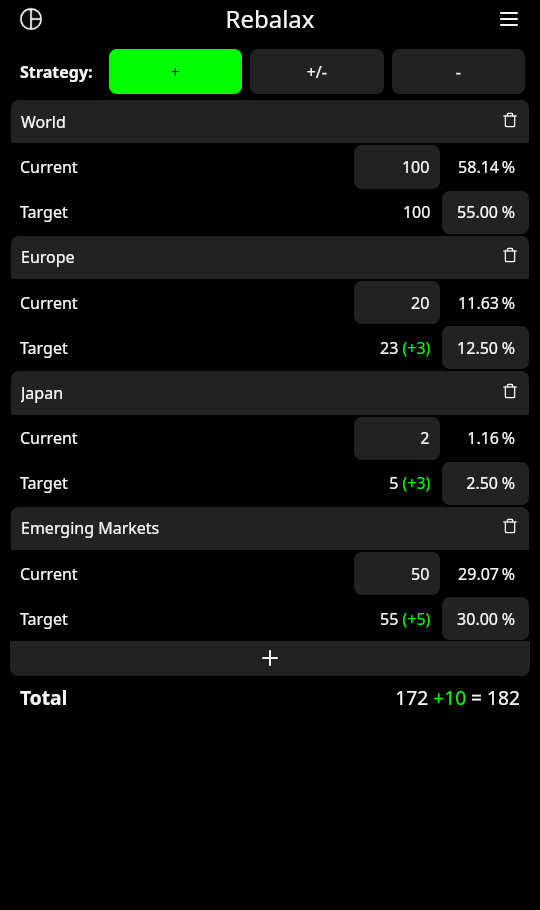
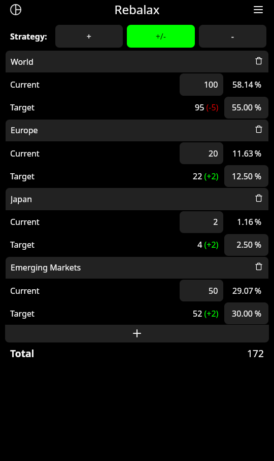

#  Rebalance + Relax = Rebalax

[](https://github.com/reifenrath-dev/rebalax/actions/workflows/android.yml)

<a href="https://apps.obtainium.imranr.dev/redirect.html?r=obtainium://add/https://github.com/reifenrath-dev/rebalax">
    
</a>
<a href="https://github.com/reifenrath-dev/rebalax/releases/latest">
    
</a>

**Available languages:** english and german

## Screenshots
<p float="left">
    
    
    
</p>

## App Verification Hash

```
D7:D8:D0:F5:ED:14:24:64:3F:43:4F:EE:4B:F0:0D:61:70:5F:D7:B7:4B:7B:C9:0B:C9:7B:A6:C7:96:07:B2:27
```

## Development
### Setup

Make sure tauri-cli and trunk-cli are installed.

```shell
cargo install tauri trunk --locked
```

Or install all dependencies of the project using the following command while in the project directory:
```shell
cargo install --path .
```

Also make sure to meet the prerequisites: https://tauri.app/start/prerequisites/#linux

### Local Testing

```shell
cargo tauri dev
```

### Building Android APKs

```shell
cargo tauri android build --apk --split-per-abi
```

## Release

1. Use the update-version.sh to update the versions of both Cargo.toml files and the tauri.conf.json.
2. Merge the updated version via PR
3. Push a new git tag with the same version number on main. This should trigger the release pipeline.